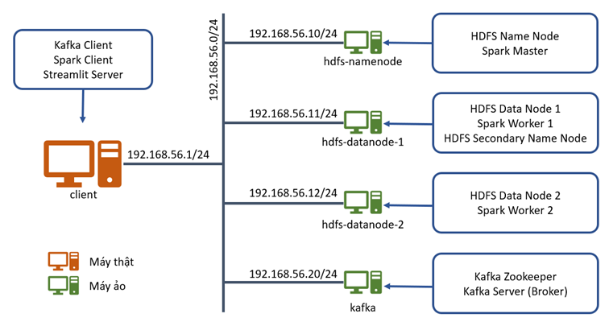

# Phân tích dữ liệu xổ số miền Bắc

Bài tập lớn môn Lưu trữ và xử lý dữ liệu lớn của **Nhóm 1** do **TS. Nguyễn Hữu Đức** hướng dẫn.

## 1. Phân công công việc
- **Trần Thế Anh (20183688):** Nhóm trưởng, cài đặt Spark trên Yarn của HDFS, phân tích dữ liệu bằng Spark, làm slide
- **Nguyễn Quang Hưng (20183760):** Cài đặt Kafka, viết chương trình producer và consumer cho kafka
- **Phạm Xuân Lộc (20183786):** Tìm nguồn dữ liệu, tìm cách crawl dữ liệu
- **Trần Đình Nguyên (20183807):** Visualize dữ liệu phân tích được bằng Streamlit 
- **Nguyễn Huy Hiếu (20183742):** Cài đặt HDFS và kết nối tới Kafka
- **Cả nhóm:** Lên kế hoạch, đề tài và viết báo cáo

## 2. Mô tả bài tập lớn
### a. Sơ đồ tổng quan hệ thống

**Mô tả:** Nhìn chung, dữ liệu sẽ được crawl từ một trang web về kết quả xổ số miền Bắc [ketqua1.net](https://ketqua1.net/so-ket-qua), sau đó dữ liệu được đẩy vào Kafka để trung chuyển. Tiếp theo, Kafka sẽ lưu dữ liệu gửi tới vào HDFS. Kế tiếp, Spark thông qua YARN để đọc dữ liệu từ HDFS và phân tích dữ liệu, dữ liệu được phân tích xong sẽ được lưu vào hệ thống file local. Cuối cùng, một chương trình được build bằng thư viện Streamlit sẽ đọc dữ liệu đã phân tích và visualize lên.

### b. Sơ đồ triển khai tầng vật lý

### c. Visualize
Trang web demo sản phẩm: [Streamlit](https://theanhtran372000-lotterydataanalysis-streamlitapp-ylbkz9.streamlitapp.com/)

Dưới đây là hình ảnh minh họa sản phẩm:

